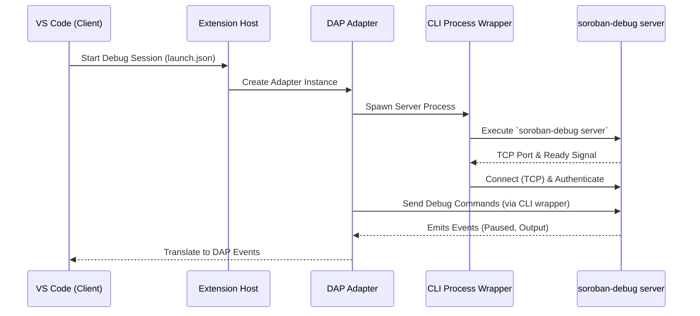

# VS Code Extension and DAP Adapter Architecture

The Soroban Debugger VS Code extension integrates the Rust-based debugging engine with Visual Studio Code using the [Debug Adapter Protocol (DAP)](https://microsoft.github.io/debug-adapter-protocol/).

## Overview

The extension architecture consists of three main boundaries:

1. **VS Code Extension Host (`extension.ts`)**: Manages the extension lifecycle, provides UI commands (like preflight checks and source map diagnostics), and acts as the factory for debug sessions.
2. **Debug Adapter (`src/dap/adapter.ts`)**: Implements the DAP interface. It translates standard DAP requests from VS Code into specific Soroban debugger wire protocol commands.
3. **CLI Process Wrapper (`src/cli/debuggerProcess.ts`)**: Spawns and manages the underlying `soroban-debug server` process. It handles the TCP connection, authentication, and wire protocol framing.

## Architecture Diagram

## Debug Adapter Protocol (DAP) Implementation

The `SorobanDebugAdapter` handles the bidirectional mapping between VS Code and the Soroban Debugger:

### Initialization and Launch
- **`initializeRequest`**: Advertises capabilities to VS Code, such as support for log points, hovers, and exception info. It explicitly disables unsupported features (like conditional breakpoints).
- **`launchRequest`** / **`attachRequest`**: Validates configuration, manages the local `soroban-debug` process lifecycle (if launching), and initiates the remote connection to the debug server.

### Execution Control
- **Stepping**: Maps DAP `next`, `stepIn`, and `stepOut` requests to the debugger's stepping commands.
- **Breakpoints**: Maps DAP `setBreakpointsRequest` to the Soroban debugger breakpoint system. Since WASM source mapping can be heuristic, the adapter handles "unverified" breakpoints and attempts to resolve them to function boundaries via `ResolveSourceBreakpoints`.

### State Inspection
- **`threadsRequest` / `stackTraceRequest`**: Soroban execution is effectively single-threaded. The adapter reports a single main thread and translates the debugger's call stack into DAP stack frames.
- **`scopesRequest` / `variablesRequest`**: Maps contract storage and local arguments to DAP variables. It supports pagination and deep inspection of structured Soroban types (like maps and vectors).
- **`evaluateRequest`**: Translates debug console inputs into expression evaluations or storage searches/paging commands.

## Process Management and Communication

The `DebuggerProcess` class abstracts the interaction with the Rust binary:
- It spawns the process with dynamic port allocation.
- It parses line-delimited JSON messages (the Wire Protocol) coming from the server.
- It provides a typed, promise-based RPC interface for the DAP adapter to send requests and await responses.
- It handles connection loss, timeouts, and session cleanup.

## Handling Differences in Capabilities

Not all CLI features are exposed through the DAP adapter. The adapter acts as a focused subset tailored for an IDE experience. Features like instruction-level stepping, full storage export, and advanced analysis subcommands are intentionally left to the CLI.

For more details on feature parity, refer to the Feature Matrix.

## Manifest and Validation

The extension's configuration schema (`launch.json` properties) is strictly defined in `package.schema.json`. This enables static validation of user configurations and ensures the adapter receives properly typed arguments.